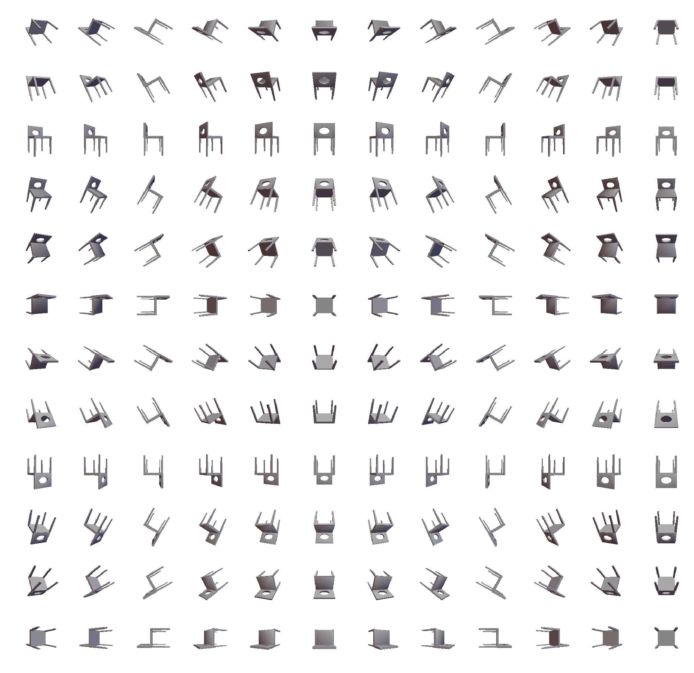

## A toy renderer for simple rendering

`toy-renderer` is a simple renderer to render a 3D object in various viewpoints. It's written in C++ and uses old OpenGL (Pre-OpenGL 3.0). 

#### Dependencies 
[`OpenCV`](https://opencv.org/), [`OpenGL`](https://www.opengl.org/), [`OpenMesh`](https://www.openmesh.org/), [`Boost C++`](https://www.boost.org/), [`GLUT`](https://www.opengl.org/resources/libraries/glut/), [`GLEW`](http://glew.sourceforge.net/)

#### Installation
Using [`CMake`](https://cmake.org/)
```bash
cd toy-renderer
mkdir build
cd build
cmake ..
make
```

#### Usage
```bash
Usage: toy-renderer <filelist.txt> <output_dir>
```
`filelist.txt` contains a list of 3D object files (type of files must be supported by `OpenMesh` e.g. OFF and OBJ are supported.)

Each 3D object will be rendered in multiple viewpoints and the rendered images will be written to `output_dir/obj_filename/`.

#### Sample rendered images for a single 3D object

